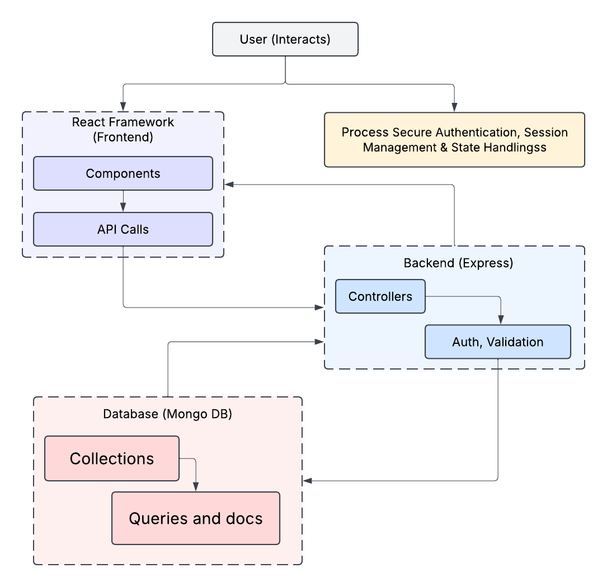

# Farm Smart
Your all-in-one farming companion, designed to help you grow smarter and more efficiently with AI-powered insights. Supports New Generation Farmers to plan effectively and manage productivity

## Website Frontend


## System Architecture


## Project Structure
```
farm-smart/
|-- backend/
|   |-- controllers/
|   |   |-- subsidyController.js
|   |   |-- cropPriceController.js
|   |   |-- adviceController.js
|   |-- models/
|   |   |-- subsidyModel.js
|   |   |-- cropPriceModel.js
|   |   |-- userModel.js
|   |-- routes/
|   |   |-- subsidyRoutes.js
|   |   |-- cropPriceRoutes.js
|   |   |-- adviceRoutes.js
|   |   |-- authRoutes.js
|   |-- middleware/
|   |   |-- authMiddleware.js
|   |-- config/
|   |   |-- db.js
|   |-- index.js
|
|-- frontend/
|   |-- public/
|   |   |-- index.html
|   |-- src/
|   |   |-- components/
|   |   |   |-- Navbar.js
|   |   |   |-- Footer.js
|   |   |   |-- Home.js
|   |   |   |-- Dashboard.js
|   |   |   |-- Login.js
|   |   |-- App.js
|   |   |-- index.js
|   |-- package.json
|
|-- package.json
|-- .gitignore
|-- README.md
```


